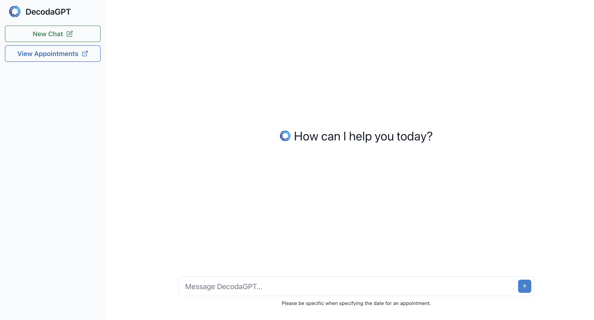

# Welcome to DecodaGPT

Your personalized AI assistant with the ability to answer questions and schedule appointments.

## Setup

1. Clone the repo locally
2. Add a `.env` file in the backend folder
   1. This file should contain your Open AI api key in the following format:
      OPENAI_API_KEY=insert-api-key-here
3. Ensure Docker is running in the background
4. Run `docker-compose up` inside the root folder to start the application (this may take a bit).
5. Once step 4 is complete, go to `http://localhost:3006/` to see DecodaGPT!

If the build fails, try removing the container and images and try again. Use `docker-compose up --build` to rebuild images.

## Features

<ins>Ask it anything!</ins>

- What is 65 \* 243?
- Write me a rap song using references to SpongeBob SquarePants.

<ins>Schedule an appointment</ins>

- Make a 1 hour appointment for Feb 24, 2024 at 10pm for my foot injury
- Schedule a 20 minute appointment on March 5th at noon for my torn achilles

## Examples

### Schedule an apppointment:

### View and message old chats:

### Ask general questions:

### View all appointments

